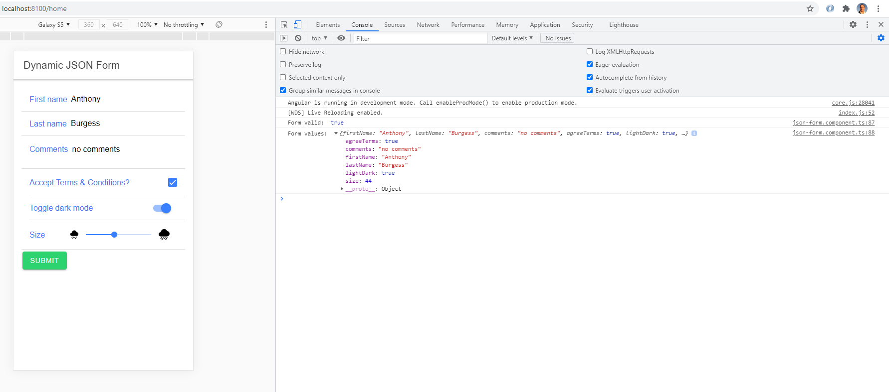

# :zap: Ionic API TechData

* Displays a reactive form with controls defined in a JSON file
* Code from [Joshua Morony](https://www.youtube.com/channel/UCbVZdLngJH6KOJvpAOO3qTw) - see [:clap: Inspiration](#clap-inspiration) below
* **Note:** to open web links in a new window use: _ctrl+click on link_


## :page_facing_up: Table of contents

* [:zap: Ionic API TechData](#zap-ionic-api-techdata)
  * [:page\_facing\_up: Table of contents](#page_facing_up-table-of-contents)
  * [:books: General info](#books-general-info)
  * [:camera: Screenshots](#camera-screenshots)
  * [:signal\_strength: Technologies](#signal_strength-technologies)
  * [:floppy\_disk: Setup](#floppy_disk-setup)
  * [:computer: Code Examples](#computer-code-examples)
  * [:cool: Features](#cool-features)
  * [:clipboard: Status \& To-do list](#clipboard-status--to-do-list)
  * [:clap: Inspiration](#clap-inspiration)
  * [:file\_folder: License](#file_folder-license)
  * [:envelope: Contact](#envelope-contact)

## :books: General info

* [Angular ChangeDetectionStrategy](https://angular.io/api/core/ChangeDetectionStrategy) set to OnPush, so automatic change detection set to off.

## :camera: Screenshots



## :signal_strength: Technologies

* [Ionic/angular v6](https://ionicframework.com/)
* [Ionic v6](https://ionicframework.com/)
* [Angular v15](https://angular.io/)
* [Reactive Forms](https://angular.io/guide/reactive-forms) model-driven approach to handling form inputs whose values change over time.
* [Transform.Tools](https://transform.tools/) online data format conversion

## :floppy_disk: Setup

* Load dependencies using `npm i`,
* To start the server on _localhost://8100_ type: 'ionic serve'

## :computer: Code Examples

* `json-form.component.ts` method to create a form from the `data-form.json` values

```typescript
  createForm(controls: IJsonFormControls[]) {
    for (const control of controls) {
      const validatorsToAdd = [];

      for (const [key, value] of Object.entries(control.validators)) {
        switch (key) {
          case 'min':
            validatorsToAdd.push(Validators.min(value));
            break;
          case 'max':
            validatorsToAdd.push(Validators.max(value));
            break;
          case 'required':
            if (value) {
              validatorsToAdd.push(Validators.required);
            }
            break;
          case 'requiredTrue':
            if (value) {
              validatorsToAdd.push(Validators.requiredTrue);
            }
            break;
          case 'email':
            if (value) {
              validatorsToAdd.push(Validators.email);
            }
            break;
          case 'minLength':
            validatorsToAdd.push(Validators.minLength(value));
            break;
          case 'maxLength':
            validatorsToAdd.push(Validators.maxLength(value));
            break;
          case 'pattern':
            validatorsToAdd.push(Validators.pattern(value));
            break;
          case 'nullValidator':
            if (value) {
              validatorsToAdd.push(Validators.nullValidator);
            }
            break;
          default:
            break;
        }
      }

      this.dataForm.addControl(
        control.name,
        this.fb.control(control.value, validatorsToAdd)
      );
    }
    console.log('data form: ', this.dataForm);
  }
```

## :cool: Features

* Defines reactive form controls from a JSON file

## :clipboard: Status & To-do list

* Status: Working
* To-do: Nothing

## :clap: Inspiration

* [Josh Morony: Create a Dynamic Reactive Angular Form with JSON](https://www.youtube.com/watch?v=ByHw_RMjkKM&t=48s)

## :file_folder: License

* N/A

## :envelope: Contact

* Repo created by [ABateman](https://github.com/AndrewJBateman), email: gomezbateman@yahoo.com
