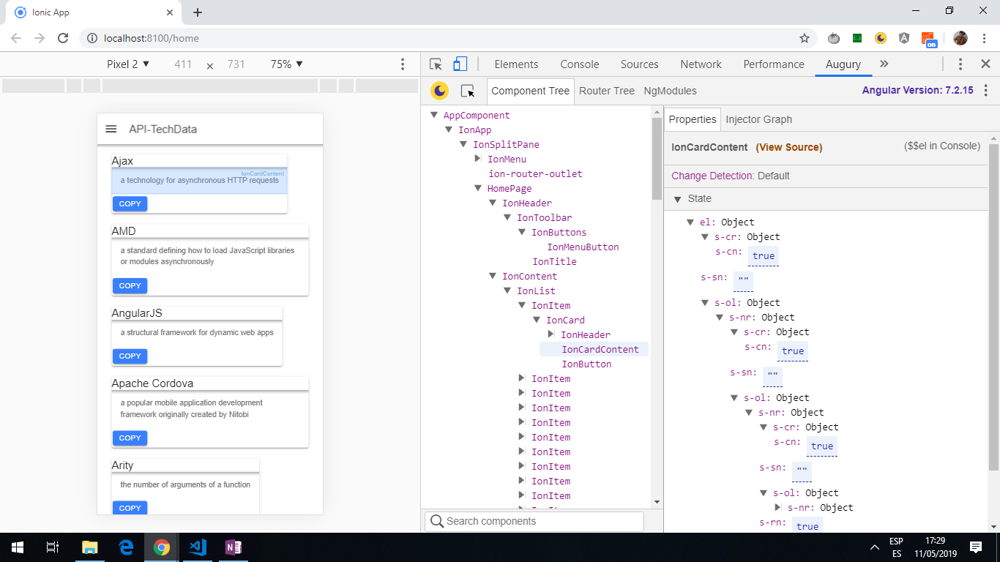

# Ionic API TechData

App to display json data from an [API json file](https://media.jscrambler.com/blog/data.json) using the [Ionic 4 framework](https://ionicframework.com/docs) and [Capacitor](https://capacitor.ionicframework.com/).

## Table of contents

* [General info](#general-info)
* [Screenshots](#screenshots)
* [Technologies](#technologies)
* [Setup](#setup)
* [Features](#features)
* [Status](#status)
* [Inspiration](#inspiration)
* [Contact](#contact)

## General info

* This is a Progressive Web App that make a call to an [external json file](https://media.jscrambler.com/blog/data.json) for technical data. This is displayed using Ionic cards with data-binding to the json content.

* There is a copy button that will copy the Ionic card contents using a Capacitor Clipboard plugin.

## Screenshots



## Technologies

* [Ionic/angular v4.0.0](https://ionicframework.com/)

* [Progressive Web App PWA](https://ionicframework.com/docs/publishing/progressive-web-app) using a service worker for instant loading and offline support.

* [Capacitor v1.0.0-beta.24](https://capacitor.ionicframework.com/) open source native container used to build the app to run on iOS, Android, Electron (Desktop).

* [CORS Chrome Plugin](chrome://extensions/?id=digfbfaphojjndkpccljibejjbppifbc) to allow cross-domain requestst to be sent, also overrides Request Origin and CORS headers.

## Setup

* To start the server on _localhost://8100_ type: 'ionic serve'

## Code Examples

* home.page.ts methods to get data once Ionic page loaded

```typescript
// add the event that is called when the ionic page is loaded then call getData() method
ionViewDidEnter() {
  this.getData();
}

// method to call get() method of HttpClient and subscribe to the returned Observable
// assign fetched data to the entries varaible.
getData() {
  this.httpClient.get(this.API_URL).subscribe((entries: any[]) => {
    this.entries = entries;
  });
}
```

## Features

* Copy function copies to Clipboard.

## Status & To-do list

* Status: working basic API news app.

* To-do: Change tabs to new system. Add a lot more detail/styling to front page.

## Inspiration

* [jscrambler blog by Ahmed Bouchefra: Create an Ionic 4 PWA with Capacitor](https://blog.jscrambler.com/create-an-ionic-4-pwa-with-capacitor/).

* [jscrambler blog](https://jscrambler.com/)

## Contact

Created by [ABateman](https://www.andrewbateman.org) - feel free to contact me!